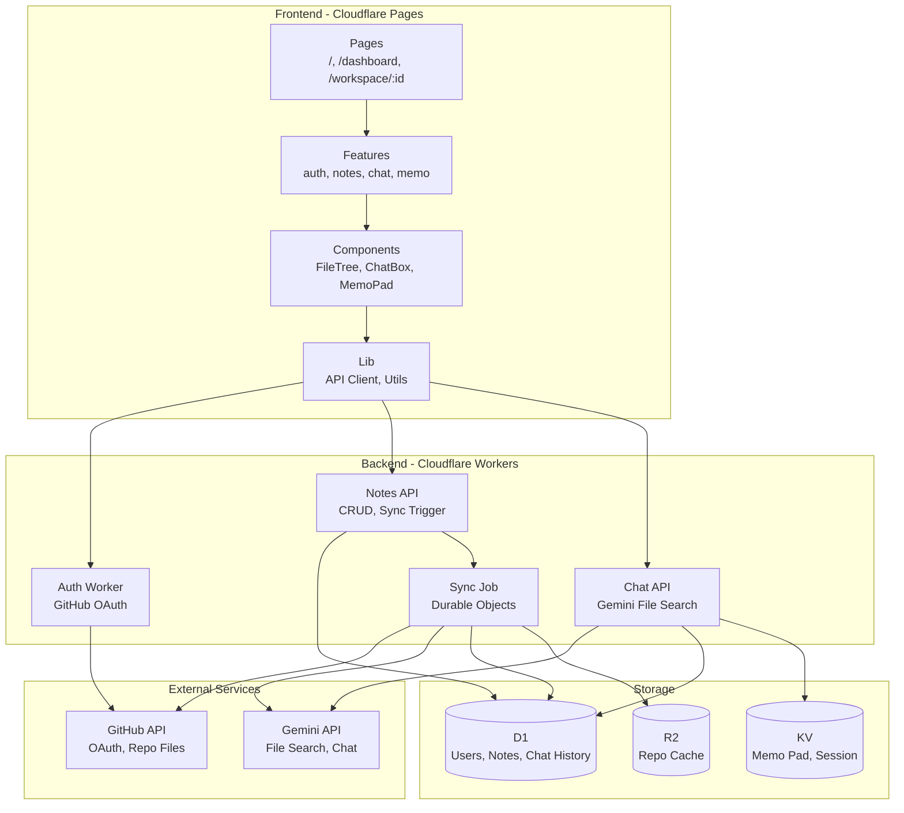
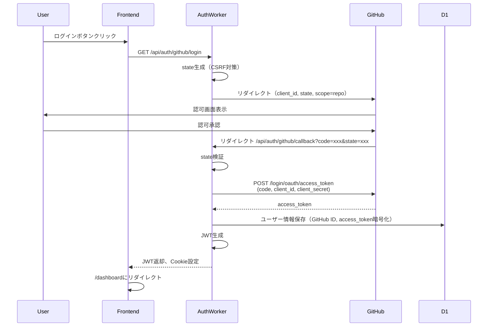
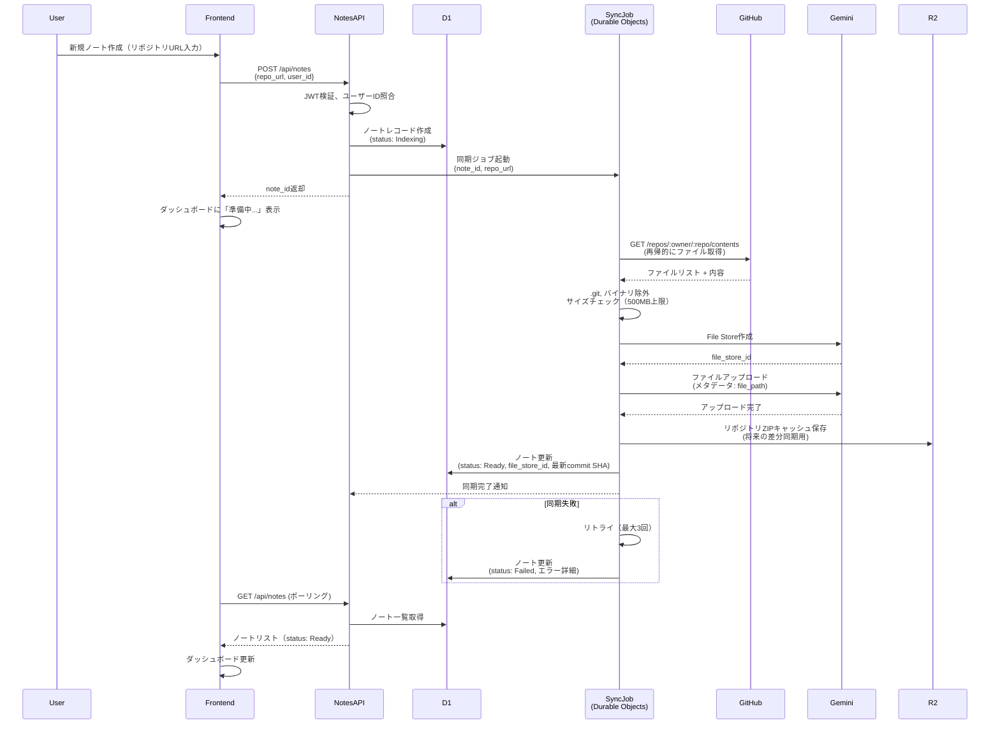
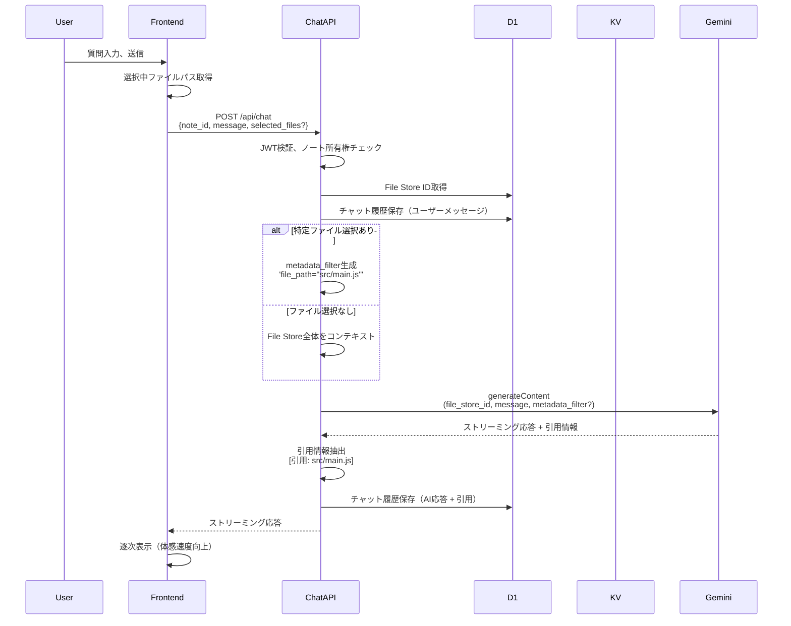

# Technical Design Document

## Overview

DevNote は、GitHubリポジトリをGemini API File Searchで学習し、Notebook LM風の統合ワークスペースでユーザーがコードベースについて対話的に探索できるRAGアプリケーションである。本設計は、Cloudflare Workersエコシステム（Pages, D1, KV, R2, Durable Objects）上に完全サーバーレスアーキテクチャを構築し、GitHub OAuthによるプライベートリポジトリアクセス、3カラムレイアウト（ファイルツリー・チャット・メモパッド）の統合UI、引用ベースの信頼できるAI回答を提供する。

本ドキュメントは、15の要件（認証、ダッシュボード、データ同期、ワークスペース、永続化、セキュリティ、パフォーマンス、エラーハンドリング、コスト管理、PoC検証）を、明確なコンポーネント境界とインターフェース契約に変換する。主要な技術決定として、Gemini File Searchのメタデータフィルタリングによるコンテキスト指定、Durable Objectsによる同期ジョブ管理、D1/KV/R2の責務分割を採用している。

設計の焦点は、ユーザーごとに独立したノート（ワークスペース）を管理し、リポジトリ単位でGemini File Storeとの1対1紐づけを維持することで、コンテキスト分離と引用精度を担保することにある。

### Goals
- GitHubリポジトリの自動インデックス化と、Gemini File Searchによる引用ベースRAG検索を実現する
- 3カラムレイアウト（ソース・対話・知見）の統合ワークスペースで、シームレスなコードベース探索体験を提供する
- GitHub OAuth認証によりプライベートリポジトリへアクセスし、ユーザーごとに完全に分離されたノート管理を実現する
- Cloudflare Workersエコシステムで完全サーバーレス、グローバル低レイテンシー、コスト最適化されたアーキテクチャを構築する
- 非同期の同期ジョブ、エラーハンドリング、リトライロジックで信頼性の高いデータインデックス処理を実現する

### Non-Goals
- Phase 1では、GitHub Webhookによる自動再同期は対象外（手動再同期のみ）
- Phase 1では、複数リポジトリの横断検索は対象外（1ノート = 1リポジトリ）
- Phase 1では、チーム共有機能やコラボレーション機能は対象外（個人利用のみ）
- カスタムRAGスタック（独自Embedding、ベクトルDB構築）は対象外（Gemini File Searchに完全委譲）
- オンプレミスやセルフホスティングは対象外（Cloudflare専用）

## Architecture

### Architecture Pattern & Boundary Map

**選定パターン**: **Layered Architecture + Feature-Sliced Design**

- **Layered Architecture**: Pages → Features → Components → Lib の依存方向で階層化し、ビジネスロジックとUIを分離
- **Feature-Sliced Design**: 機能単位（auth, notes, chat, memo）でディレクトリを分割し、並列開発とスケーラビリティを確保

**ドメイン境界**:
- **Authentication Domain**: GitHub OAuthフロー、JWT発行、セッション管理
- **Notes Management Domain**: ノート作成・削除・再同期、Gemini File Store紐づけ
- **Sync Job Domain**: GitHub API連携、ファイル取得、File Storeアップロード、リトライロジック
- **Chat Domain**: Gemini API連携、メタデータフィルタリング、ストリーミング応答、引用抽出
- **Workspace UI Domain**: 3カラムレイアウト、ファイルツリー、メモパッド、レスポンシブ対応

**Steering準拠**:
- `structure.md`の依存方向（Pages → Features → Components → Lib）を遵守
- `tech.md`のTypeScript strict mode、Cloudflare Workersエコシステム採用
- `product.md`のコアバリュー（コンテキスト分離、3要素連携、根拠明示）を実現



**主要コンポーネントと責務**:
- **Frontend Pages**: ユーザー向け画面（トップ、ダッシュボード、ワークスペース）
- **Features**: 機能ごとのロジック集約（カスタムフック、API呼び出し、状態管理）
- **Components**: 汎用UIコンポーネント（ビジネスロジックを持たない）
- **Auth Worker**: GitHub OAuthフロー、JWT発行
- **Notes API**: ノートCRUD、同期ジョブトリガー
- **Chat API**: Gemini連携、メタデータフィルタリング、ストリーミング
- **Sync Job (Durable Objects)**: 非同期同期処理、リトライロジック、ステータス管理

### Technology Stack

| Layer | Choice / Version | Role in Feature | Notes |
|-------|------------------|-----------------|-------|
| **Frontend** | React 18+ (Vite) | SPAフロントエンド、3カラムレイアウトUI | TypeScript strict mode、Cloudflare Pages デプロイ |
| **Frontend** | TypeScript 5+ | フロント・バックエンド共通型定義 | `any` 禁止、strict mode 有効 |
| **Backend** | Cloudflare Workers | サーバーレスAPIエンドポイント | Web API準拠、Node.js非互換に注意 |
| **Backend** | Cloudflare Pages Functions | フロントエンドと統合されたAPI | `/api/*` ルーティング |
| **Data** | Cloudflare D1 (SQLite) | ユーザー、ノート、チャット履歴テーブル | リレーショナルクエリ、ACID保証 |
| **Data** | Cloudflare KV | メモパッド内容、セッション情報 | 高頻度書き込み、低レイテンシー |
| **Data** | Cloudflare R2 | GitHubリポジトリZIPキャッシュ | S3互換、エグレス無料 |
| **Infrastructure** | Cloudflare Durable Objects | 同期ジョブ管理、強整合性ステート | ノートごとに1インスタンス |
| **LLM/RAG** | Google Gemini API 2.5 Pro/Flash | File Search、チャット生成、引用抽出 | メタデータフィルタリング、ストリーミング |
| **Authentication** | GitHub OAuth | ユーザー認証、リポジトリアクセス | `repo` スコープ要求 |
| **API Client** | Octokit (GitHub API) | リポジトリファイル取得 | レート制限対応、リトライ |

**技術選定の根拠**（詳細は`research.md`参照）:
- **Gemini File Search**: チャンキング・Embedding・ベクトルDB管理を完全委譲、メタデータフィルタリングでコンテキスト指定
- **Cloudflare Workersエコシステム**: D1でリレーショナルデータ、KVで高頻度書き込み、R2でキャッシュ、Durable Objectsで同期ジョブ管理
- **Durable Objects**: 同期ジョブの強整合性、リトライロジック内包、競合なし
- **D1/KV分離**: チャット履歴はクエリ必要でD1、メモパッドは単純key-valueでKV

## System Flows

### GitHub OAuth認証フロー



**主要な決定**:
- `state`パラメータでCSRF攻撃を防止（`research.md`のセキュリティ考慮事項参照）
- アクセストークンはD1に暗号化保存、クライアントには露出させない
- JWTはCookieに設定し、すべてのAPI呼び出しで検証

### ノート作成・同期フロー



**主要な決定**:
- Durable Objectsで同期ジョブを管理（強整合性、リトライロジック内包）
- 最大3回の自動リトライ（`research.md`のリスク緩和策参照）
- メタデータとして`file_path`を各ファイルに付与（コンテキスト指定用）
- R2にZIPキャッシュ保存（Phase 2の差分同期最適化用）

### チャット質問・回答フロー



**主要な決定**:
- メタデータフィルタリングで選択ファイルを優先参照（`research.md`のPoC検証必須）
- ストリーミング応答で体感速度向上（Requirement 12）
- 引用情報を`[引用: src/main.js]`形式で明示（Requirement 8）

## Requirements Traceability

| Requirement | Summary | Components | Interfaces | Flows |
|-------------|---------|------------|------------|-------|
| 1 | ユーザー認証（GitHub OAuth） | AuthWorker, AuthFeature, JWTService | AuthService, JWTService | GitHub OAuth認証フロー |
| 2 | ダッシュボード - ノート一覧表示 | DashboardPage, NoteCard, NotesAPI | NotesService, NoteListAPI | - |
| 3 | ダッシュボード - ノート作成 | CreateNoteDialog, NotesAPI, SyncJobDO | NotesService, SyncJobAPI | ノート作成・同期フロー |
| 4 | ダッシュボード - ノート管理（再同期・削除・エクスポート） | NoteCard, NotesAPI, SyncJobDO | NotesService, SyncJobAPI | ノート作成・同期フロー |
| 5 | データ同期・インデックス | SyncJobDO, GitHubClient, GeminiClient | SyncJobAPI, GitHubService, GeminiFileService | ノート作成・同期フロー |
| 6 | ワークスペース - レイアウト | WorkspaceLayout, ResponsiveLayoutHook | WorkspaceLayoutProps | - |
| 7 | ワークスペース - ファイルツリー | FileTree, FileNode | FileTreeProps, FileNode | - |
| 8 | ワークスペース - チャット | ChatBox, ChatHistory, ChatAPI | ChatService, ChatMessageAPI | チャット質問・回答フロー |
| 9 | ワークスペース - メモパッド | MemoPad, MemoAPI | MemoPadProps, MemoService | - |
| 10 | データ永続化 | D1Schema, KVService, R2Service | D1Tables, KVClient, R2Client | - |
| 11 | セキュリティ | JWTService, EncryptionService, AuditLogger | JWTService, EncryptionService | GitHub OAuth認証フロー |
| 12 | パフォーマンス | StreamingResponse, DebounceHook, AsyncJobQueue | - | チャット質問・回答フロー |
| 13 | エラーハンドリング・制限事項 | ErrorBoundary, RetryService, SizeValidator | ErrorHandler, RetryService | ノート作成・同期フロー |
| 14 | コスト管理・スケーラビリティ | QuotaService, ArchiveService, MetricsCollector | QuotaService, MetricsAPI | - |
| 15 | PoC検証事項 | PoCValidator, MetadataFilterTest | - | - |

## Components and Interfaces

### コンポーネント概要

| Component | Domain/Layer | Intent | Req Coverage | Key Dependencies (P0/P1) | Contracts |
|-----------|--------------|--------|--------------|--------------------------|-----------|
| AuthWorker | Backend / Auth | GitHub OAuthフロー、JWT発行 | 1, 11 | GitHub API (P0), D1 (P0) | API |
| NotesAPI | Backend / Notes | ノートCRUD、同期トリガー | 2, 3, 4, 10 | D1 (P0), SyncJobDO (P0) | API, Service |
| ChatAPI | Backend / Chat | Gemini連携、ストリーミング応答 | 8, 12 | Gemini API (P0), D1 (P0), KV (P1) | API, Service |
| SyncJobDO | Backend / Sync | 同期ジョブ管理、リトライロジック | 5, 13 | GitHub API (P0), Gemini API (P0), D1 (P0), R2 (P1) | Service, State |
| DashboardPage | Frontend / Pages | ノート一覧・作成・管理UI | 2, 3, 4 | NotesFeature (P0), AuthFeature (P0) | - |
| WorkspaceLayout | Frontend / Pages | 3カラムレイアウト、レスポンシブ | 6 | FileTree (P0), ChatBox (P0), MemoPad (P0) | - |
| FileTree | Frontend / Components | ファイルツリー表示、選択管理 | 7 | NotesFeature (P1) | State |
| ChatBox | Frontend / Components | チャット入力・履歴表示 | 8, 12 | ChatFeature (P0), FileTree (P1) | State |
| MemoPad | Frontend / Components | メモパッド編集・自動保存 | 9, 12 | MemoFeature (P0) | State |
| JWTService | Backend / Shared | JWT検証、ユーザーID抽出 | 1, 11 | - | Service |
| EncryptionService | Backend / Shared | GitHubトークン暗号化 | 11 | - | Service |

### Backend / Authentication Domain

#### AuthWorker

| Field | Detail |
|-------|--------|
| Intent | GitHub OAuthフロー、アクセストークン取得、JWT発行 |
| Requirements | 1, 11 |

**Responsibilities & Constraints**
- GitHub OAuth 2.0フローの実装（`/login`, `/callback`エンドポイント）
- `state`パラメータによるCSRF攻撃防止
- アクセストークンの暗号化保存（D1）、JWT発行

**Dependencies**
- Outbound: GitHub OAuth API — OAuth認証、トークン交換 (P0)
- Outbound: D1 — ユーザー情報・トークン保存 (P0)
- Outbound: EncryptionService — アクセストークン暗号化 (P0)

**Contracts**: API [X]

##### API Contract

| Method | Endpoint | Request | Response | Errors |
|--------|----------|---------|----------|--------|
| GET | /api/auth/github/login | - | Redirect to GitHub | - |
| GET | /api/auth/github/callback | `code`, `state` (query params) | `{jwt: string}` + Set-Cookie | 400 (invalid state), 401 (OAuth failed) |
| POST | /api/auth/logout | - | `{success: true}` | 401 (unauthorized) |

**Implementation Notes**
- Integration: `gr2m/cloudflare-worker-github-oauth-login`パターンを参考（`research.md`参照）
- Validation: `state`パラメータをセッションに保存し、callbackで検証
- Risks: GitHub APIレート制限、トークン有効期限切れ（`Auth Required`ステータスで再認証促す）

#### JWTService

| Field | Detail |
|-------|--------|
| Intent | JWT検証、ユーザーID抽出、トークンリフレッシュ |
| Requirements | 1, 11 |

**Responsibilities & Constraints**
- すべてのAPI呼び出しでJWTを検証
- ユーザーIDとノートIDの所有権照合
- JWT有効期限管理（24時間）

**Dependencies**
- Inbound: すべてのAPI (NotesAPI, ChatAPI, MemoAPI) — JWT検証 (P0)

**Contracts**: Service [X]

##### Service Interface

```typescript
interface JWTService {
  /**
   * JWTを生成する
   * @param userId ユーザーID
   * @param expiresIn 有効期限（秒）
   * @returns JWT文字列
   */
  generateToken(userId: string, expiresIn: number): Promise<string>;

  /**
   * JWTを検証し、ユーザーIDを抽出する
   * @param token JWT文字列
   * @returns ユーザーID
   * @throws UnauthorizedError トークン無効時
   */
  verifyToken(token: string): Promise<string>;

  /**
   * ノートの所有権を検証する
   * @param userId ユーザーID
   * @param noteId ノートID
   * @returns true: 所有権あり、false: なし
   */
  verifyNoteOwnership(userId: string, noteId: string): Promise<boolean>;
}
```

- Preconditions: JWTシークレットが環境変数に設定されている
- Postconditions: 検証成功時はユーザーID返却、失敗時は例外スロー
- Invariants: トークンは改ざん不可、有効期限切れは拒否

### Backend / Notes Management Domain

#### NotesAPI

| Field | Detail |
|-------|--------|
| Intent | ノートCRUD、同期ジョブトリガー、ステータス管理 |
| Requirements | 2, 3, 4, 10 |

**Responsibilities & Constraints**
- ノート一覧取得、作成、削除、再同期
- 同期ジョブ（SyncJobDO）の起動とステータス監視
- ユーザーごとのノート上限（10件）チェック

**Dependencies**
- Inbound: Frontend (DashboardPage, NotesFeature) — ノート操作 (P0)
- Outbound: D1 — ノートテーブルCRUD (P0)
- Outbound: SyncJobDO — 同期ジョブ起動 (P0)
- Outbound: JWTService — JWT検証、所有権チェック (P0)

**Contracts**: API [X] / Service [X]

##### API Contract

| Method | Endpoint | Request | Response | Errors |
|--------|----------|---------|----------|--------|
| GET | /api/notes | - (JWT in Cookie) | `{notes: Note[]}` | 401 (unauthorized) |
| POST | /api/notes | `{repo_url: string}` | `{note_id: string, status: 'Indexing'}` | 400 (invalid URL), 409 (quota exceeded), 401 |
| DELETE | /api/notes/:id | - | `{success: true}` | 404 (not found), 403 (forbidden), 401 |
| POST | /api/notes/:id/sync | - | `{job_id: string, status: 'pending'}` | 404, 403, 401 |

##### Service Interface

```typescript
interface Note {
  id: string;
  user_id: string;
  repo_url: string;
  repo_name: string;
  file_store_id: string | null;
  status: 'Indexing' | 'Ready' | 'Failed' | 'Auth Required';
  last_synced_at: string | null;
  latest_commit_sha: string | null;
  error_message: string | null;
  created_at: string;
  updated_at: string;
}

interface NotesService {
  /**
   * ユーザーのノート一覧を取得する
   */
  listNotes(userId: string): Promise<Note[]>;

  /**
   * 新規ノートを作成し、同期ジョブを開始する
   */
  createNote(userId: string, repoUrl: string): Promise<{noteId: string; jobId: string}>;

  /**
   * ノートを削除する（File Store, チャット履歴, メモも削除）
   */
  deleteNote(userId: string, noteId: string): Promise<void>;

  /**
   * 再同期を実行する
   */
  resyncNote(userId: string, noteId: string): Promise<{jobId: string}>;
}
```

- Preconditions: JWTが有効、ユーザーIDが存在
- Postconditions: ノート作成時は同期ジョブが起動される
- Invariants: ユーザーあたりノート上限10件、1ノート = 1 File Store

**Implementation Notes**
- Integration: SyncJobDOへのジョブ起動はDurable Object IDで管理（`note_id`をID化）
- Validation: リポジトリURL形式検証（`https://github.com/:owner/:repo`）
- Risks: GitHub APIレート制限、リポジトリサイズ超過（500MB上限）

### Backend / Sync Job Domain

#### SyncJobDO (Durable Objects)

| Field | Detail |
|-------|--------|
| Intent | 非同期同期処理、リトライロジック、ステータス管理 |
| Requirements | 5, 13 |

**Responsibilities & Constraints**
- GitHub APIからファイル取得、`.git`除外、サイズチェック
- Gemini File Storeへのアップロード（メタデータ付与）
- 最大3回の自動リトライ、指数バックオフ
- ジョブステータス（pending, in_progress, completed, failed）管理

**Dependencies**
- Inbound: NotesAPI — 同期ジョブ起動 (P0)
- Outbound: GitHub API (Octokit) — ファイル取得 (P0)
- Outbound: Gemini API — File Store作成・アップロード (P0)
- Outbound: D1 — ノートステータス更新 (P0)
- Outbound: R2 — ZIPキャッシュ保存 (P1)

**Contracts**: Service [X] / State [X]

##### Service Interface

```typescript
interface SyncJobDO {
  /**
   * 同期ジョブを開始する
   */
  startSync(noteId: string, repoUrl: string, githubToken: string): Promise<{jobId: string}>;

  /**
   * ジョブステータスを取得する
   */
  getJobStatus(jobId: string): Promise<JobStatus>;
}

interface JobStatus {
  job_id: string;
  note_id: string;
  status: 'pending' | 'in_progress' | 'completed' | 'failed';
  progress: number; // 0-100
  retry_count: number;
  error_message: string | null;
  started_at: string | null;
  completed_at: string | null;
}
```

- Preconditions: GitHubトークンが有効、リポジトリURLが正しい
- Postconditions: 成功時はノートステータスが`Ready`、失敗時は`Failed`
- Invariants: 最大3回リトライ、リトライ間隔は指数バックオフ（1s, 2s, 4s）

##### State Management

- **State model**: Durable Objects の永続化ステートにジョブ情報を保存
- **Persistence & consistency**: Durable Objects の強整合性により、競合なし
- **Concurrency strategy**: 1ノートに対して1つのDurable Objectインスタンスが割り当てられ、並列実行を防止

**Implementation Notes**
- Integration: Gemini File Search APIのメタデータに`file_path`を付与（`research.md`参照）
- Validation: ファイルサイズ100MB上限、リポジトリ総サイズ500MB上限を事前チェック
- Risks: GitHub APIレート制限（リトライで対応）、Gemini File Store容量超過（警告表示）

### Backend / Chat Domain

#### ChatAPI

| Field | Detail |
|-------|--------|
| Intent | Gemini API連携、メタデータフィルタリング、ストリーミング応答、引用抽出 |
| Requirements | 8, 12 |

**Responsibilities & Constraints**
- チャットメッセージ受信、Gemini API呼び出し
- 選択ファイルに基づくメタデータフィルタリング適用
- ストリーミング応答でレイテンシー削減
- 引用情報抽出（`[引用: src/main.js]`形式）

**Dependencies**
- Inbound: Frontend (ChatBox, ChatFeature) — チャット送信 (P0)
- Outbound: Gemini API — File Search、チャット生成 (P0)
- Outbound: D1 — チャット履歴保存 (P0)
- Outbound: KV — 一時ステート保存（オプション） (P1)
- Outbound: JWTService — JWT検証、所有権チェック (P0)

**Contracts**: API [X] / Service [X]

##### API Contract

| Method | Endpoint | Request | Response | Errors |
|--------|----------|---------|----------|--------|
| POST | /api/chat | `{note_id: string, message: string, selected_files?: string[]}` | Server-Sent Events (ストリーミング) | 401, 404 (note not found), 403 (forbidden), 500 |
| GET | /api/chat/history | `note_id` (query param) | `{messages: ChatMessage[]}` | 401, 404, 403 |

##### Service Interface

```typescript
interface ChatMessage {
  id: string;
  note_id: string;
  role: 'user' | 'assistant';
  content: string;
  citations: Citation[];
  created_at: string;
}

interface Citation {
  file_path: string;
  snippet: string;
}

interface ChatService {
  /**
   * チャットメッセージを送信し、ストリーミング応答を返す
   */
  sendMessage(
    noteId: string,
    userId: string,
    message: string,
    selectedFiles?: string[]
  ): AsyncIterable<string>;

  /**
   * チャット履歴を取得する
   */
  getHistory(noteId: string, userId: string): Promise<ChatMessage[]>;
}
```

- Preconditions: ノートが`Ready`ステータス、File Store IDが存在
- Postconditions: ストリーミング完了後、D1にメッセージ保存
- Invariants: 引用情報は必ずGemini APIから取得（幻覚防止）

**Implementation Notes**
- Integration: Gemini APIの`metadata_filter`パラメータでコンテキスト指定（`research.md`参照）
- Validation: PoC検証（Requirement 15）でメタデータフィルタリング機能を確認
- Risks: Gemini APIレート制限、ストリーミング中断時の再接続ロジック

### Frontend / Pages Domain

#### DashboardPage

| Field | Detail |
|-------|--------|
| Intent | ノート一覧表示、作成ダイアログ、ステータス表示 |
| Requirements | 2, 3, 4 |

**Responsibilities & Constraints**
- ノート一覧をカード形式で表示
- ステータス（Indexing, Ready, Failed, Auth Required）ごとにUIを変更
- 「新規ノート作成」ダイアログ、「再同期」「削除」ボタン

**Dependencies**
- Outbound: NotesFeature (useNotes hook) — ノート一覧取得、CRUD操作 (P0)
- Outbound: AuthFeature (useAuth hook) — ログイン状態確認 (P0)

**Contracts**: - (プレゼンテーショナルコンポーネント)

**Implementation Notes**
- Integration: `useNotes`フックでNotesAPIを呼び出し、ポーリング（5秒間隔）でステータス更新
- Validation: リポジトリURL入力時に正規表現検証
- Risks: ポーリング頻度が高すぎるとAPI呼び出し増加（Phase 2でWebSocket検討）

#### WorkspaceLayout

| Field | Detail |
|-------|--------|
| Intent | 3カラムレイアウト、レスポンシブ対応 |
| Requirements | 6 |

**Responsibilities & Constraints**
- デスクトップ: 左20%、中央50%、右30%の固定比率
- タブレット: 中央カラムデフォルト、左右はタブ切り替え
- モバイル: 下部タブまたはスワイプで3領域切り替え

**Dependencies**
- Outbound: FileTree, ChatBox, MemoPad — 各カラムコンポーネント (P0)

**Contracts**: - (プレゼンテーショナルコンポーネント)

**Implementation Notes**
- Integration: CSS Grid または Flexbox でレスポンシブレイアウト実装
- Validation: ビューポートサイズに応じたメディアクエリ（768px, 1024px ブレークポイント）
- Risks: モバイルでのキーボード表示時に入力エリアが隠れる（viewport調整で対応）

### Frontend / Components Domain

#### FileTree

| Field | Detail |
|-------|--------|
| Intent | ファイル階層表示、選択管理、ハイライト表示 |
| Requirements | 7 |

**Responsibilities & Constraints**
- ディレクトリツリーの展開/折りたたみ
- ファイル選択状態の管理、ハイライト表示
- 選択ファイルパスを親コンポーネントに通知

**Dependencies**
- Outbound: NotesFeature (useFileTree hook) — ファイルツリー取得 (P1)

**Contracts**: State [X]

##### State Management

```typescript
interface FileNode {
  path: string;
  name: string;
  type: 'file' | 'directory';
  children?: FileNode[];
}

interface FileTreeProps {
  noteId: string;
  onFileSelect: (filePath: string | null) => void;
  selectedFile: string | null;
}
```

- State model: ローカルステートで選択状態管理、親コンポーネントに伝播
- Persistence: 不要（セッション内のみ）
- Concurrency: 単一選択のみ許可

**Implementation Notes**
- Integration: GitHub APIから取得したファイルリストをツリー構造に変換
- Validation: ファイルパスの正規化（`.git`除外）
- Risks: 巨大リポジトリでのツリー表示パフォーマンス（仮想スクロール検討）

#### ChatBox

| Field | Detail |
|-------|--------|
| Intent | チャット入力、履歴表示、ストリーミング応答 |
| Requirements | 8, 12 |

**Responsibilities & Constraints**
- チャット入力フォーム、送信ボタン
- 履歴表示（ユーザーメッセージ、AI応答、引用）
- ストリーミング応答の逐次表示

**Dependencies**
- Outbound: ChatFeature (useChat hook) — メッセージ送信、履歴取得 (P0)
- Outbound: FileTree — 選択ファイルパス取得 (P1)

**Contracts**: State [X]

##### State Management

```typescript
interface ChatBoxProps {
  noteId: string;
  selectedFiles: string[] | null;
  onMessageSend: (message: string) => void;
}
```

- State model: チャット履歴はローカルステート、D1と同期
- Persistence: D1に永続化、次回訪問時に復元
- Concurrency: 送信中は入力フォーム無効化

**Implementation Notes**
- Integration: Server-Sent Events (SSE) でストリーミング応答を受信
- Validation: メッセージ最大長チェック（5000文字）
- Risks: ストリーミング中断時の再接続、ネットワークエラーハンドリング

#### MemoPad

| Field | Detail |
|-------|--------|
| Intent | メモパッド編集、自動保存（debounce） |
| Requirements | 9, 12 |

**Responsibilities & Constraints**
- テキストエリア、編集状態管理
- debounce（2秒）付き自動保存
- チャットメッセージのピン留め（追記）

**Dependencies**
- Outbound: MemoFeature (useMemo hook) — メモ取得・保存 (P0)

**Contracts**: State [X]

##### State Management

```typescript
interface MemoPadProps {
  noteId: string;
  onPinMessage: (message: string) => void;
}
```

- State model: ローカルステート、KVと同期
- Persistence: KVに永続化、次回訪問時に復元
- Concurrency: debounceで高頻度書き込みを抑制

**Implementation Notes**
- Integration: `useDebouncedValue`フックで2秒後に自動保存
- Validation: メモパッド最大長チェック（100KB）
- Risks: KV書き込みレート制限（1 key/秒上限に注意）

### Shared / Data Access Layer

#### D1Schema

| Field | Detail |
|-------|--------|
| Intent | D1テーブル定義、マイグレーションスクリプト |
| Requirements | 10 |

**Responsibilities & Constraints**
- ユーザー、ノート、チャット履歴、ピン留めログテーブルの定義
- 外部キー制約、インデックス設定

**Dependencies**
- Inbound: すべてのバックエンドサービス (NotesAPI, ChatAPI, AuthWorker) — D1アクセス (P0)

**Contracts**: - (データモデル定義)

## Data Models

### Domain Model

**主要なエンティティ**:
- **User**: GitHubアカウントと紐づくユーザー
- **Note**: 1つのGitHubリポジトリに対応するワークスペース
- **ChatMessage**: ノート内のチャット履歴
- **MemoPad**: ノートに紐づくメモ内容
- **SyncJob**: 同期ジョブの進捗・リトライ情報

**ドメインイベント**:
- `NoteCreated`: ノート作成時、同期ジョブを開始
- `SyncCompleted`: 同期完了時、ノートステータスを`Ready`に更新
- `SyncFailed`: 同期失敗時、ノートステータスを`Failed`に更新

**ビジネスルール**:
- 1ユーザーあたりノート上限10件（Requirement 14）
- 1ノート = 1 Gemini File Store（1対1紐づけ）
- 90日間未アクセスのノートは自動アーカイブ対象（Requirement 14）

### Logical Data Model

#### Users Table (D1)

| Column | Type | Constraints | Description |
|--------|------|-------------|-------------|
| id | TEXT | PRIMARY KEY | UUID |
| github_id | TEXT | UNIQUE, NOT NULL | GitHub User ID |
| github_username | TEXT | NOT NULL | GitHub Username |
| github_token_encrypted | TEXT | NOT NULL | 暗号化されたGitHub Access Token |
| created_at | TEXT | NOT NULL | ISO 8601 |
| updated_at | TEXT | NOT NULL | ISO 8601 |

#### Notes Table (D1)

| Column | Type | Constraints | Description |
|--------|------|-------------|-------------|
| id | TEXT | PRIMARY KEY | UUID |
| user_id | TEXT | FOREIGN KEY → Users.id, NOT NULL | ユーザーID |
| repo_url | TEXT | NOT NULL | `https://github.com/:owner/:repo` |
| repo_name | TEXT | NOT NULL | `:owner/:repo` |
| file_store_id | TEXT | NULLABLE | Gemini File Store ID |
| status | TEXT | NOT NULL | `Indexing`, `Ready`, `Failed`, `Auth Required` |
| last_synced_at | TEXT | NULLABLE | ISO 8601 |
| latest_commit_sha | TEXT | NULLABLE | 最新コミットSHA |
| error_message | TEXT | NULLABLE | 同期失敗時のエラー詳細 |
| created_at | TEXT | NOT NULL | ISO 8601 |
| updated_at | TEXT | NOT NULL | ISO 8601 |
| last_accessed_at | TEXT | NOT NULL | ISO 8601（アーカイブ判定用） |

**インデックス**:
- `idx_notes_user_id` ON `user_id`
- `idx_notes_status` ON `status`
- `idx_notes_last_accessed_at` ON `last_accessed_at` (アーカイブクエリ用)

#### Chat Messages Table (D1)

| Column | Type | Constraints | Description |
|--------|------|-------------|-------------|
| id | TEXT | PRIMARY KEY | UUID |
| note_id | TEXT | FOREIGN KEY → Notes.id, NOT NULL | ノートID |
| role | TEXT | NOT NULL | `user`, `assistant` |
| content | TEXT | NOT NULL | メッセージ内容 |
| citations | TEXT | NULLABLE | JSON配列（`[{file_path, snippet}]`） |
| created_at | TEXT | NOT NULL | ISO 8601 |

**インデックス**:
- `idx_chat_messages_note_id_created_at` ON `note_id, created_at`

#### Pinned Logs Table (D1)

| Column | Type | Constraints | Description |
|--------|------|-------------|-------------|
| id | TEXT | PRIMARY KEY | UUID |
| note_id | TEXT | FOREIGN KEY → Notes.id, NOT NULL | ノートID |
| message_id | TEXT | FOREIGN KEY → ChatMessages.id, NOT NULL | チャットメッセージID |
| pinned_at | TEXT | NOT NULL | ISO 8601 |

**インデックス**:
- `idx_pinned_logs_note_id` ON `note_id`

### Physical Data Model

#### KV (Key-Value Store)

**キー設計**:
- `memo:{note_id}`: メモパッド内容（JSON: `{content: string, updated_at: string}`）
- `session:{user_id}`: セッション情報（オプション）

**TTL**:
- メモパッド: 90日間未アクセスで自動削除（`last_accessed_at`ベース）
- セッション: 24時間

#### R2 (Object Storage)

**オブジェクトキー設計**:
- `repo-cache/{note_id}/{commit_sha}.zip`: GitHubリポジトリのZIPキャッシュ
- `backup/{note_id}/metadata.json`: 削除時の軽量バックアップ

**ライフサイクルポリシー**:
- 90日間未アクセスで自動削除

### Data Contracts & Integration

#### API Data Transfer

**CreateNoteRequest**:
```typescript
interface CreateNoteRequest {
  repo_url: string; // https://github.com/:owner/:repo
}
```

**NoteResponse**:
```typescript
interface NoteResponse {
  id: string;
  user_id: string;
  repo_url: string;
  repo_name: string;
  file_store_id: string | null;
  status: 'Indexing' | 'Ready' | 'Failed' | 'Auth Required';
  last_synced_at: string | null;
  latest_commit_sha: string | null;
  error_message: string | null;
  created_at: string;
  updated_at: string;
}
```

**ChatMessageRequest**:
```typescript
interface ChatMessageRequest {
  note_id: string;
  message: string;
  selected_files?: string[]; // ファイルパス配列
}
```

**ChatMessageResponse** (Server-Sent Events):
```
data: {"type": "chunk", "content": "回答の一部"}
data: {"type": "citation", "file_path": "src/main.js", "snippet": "..."}
data: {"type": "done"}
```

#### Event Schemas

現時点ではイベント駆動アーキテクチャは採用しないが、Phase 2でGitHub Webhook対応時に以下のイベントスキーマを検討:

- `RepositoryUpdated`: GitHub Webhookからのpushイベント
- `SyncJobCompleted`: 同期ジョブ完了イベント（メトリクス収集用）

## Error Handling

### Error Strategy

**エラー分類**:
- **User Errors (4xx)**: 無効な入力、認証失敗、リソースなし
- **System Errors (5xx)**: GitHub/Gemini APIエラー、D1/KV障害、タイムアウト
- **Business Logic Errors (422)**: ノート上限超過、リポジトリサイズ超過、レート制限

**エラー応答形式**（統一）:
```typescript
interface ErrorResponse {
  error: {
    code: string; // UNAUTHORIZED, NOTE_NOT_FOUND, QUOTA_EXCEEDED, etc.
    message: string; // ユーザー向けメッセージ
    details?: Record<string, unknown>; // デバッグ情報
  };
}
```

### Error Categories and Responses

**User Errors (4xx)**:
- `400 INVALID_REPO_URL`: リポジトリURL形式が無効 → 正しい形式例を表示
- `401 UNAUTHORIZED`: JWT無効 → ログイン画面にリダイレクト
- `403 FORBIDDEN`: ノート所有権なし → アクセス権限エラー表示
- `404 NOTE_NOT_FOUND`: ノートが存在しない → ダッシュボードに戻る

**System Errors (5xx)**:
- `500 GITHUB_API_ERROR`: GitHub API呼び出し失敗 → リトライ（最大3回）、失敗時は`Failed`ステータス
- `500 GEMINI_API_ERROR`: Gemini API呼び出し失敗 → リトライ、レート制限時は待ち時間表示
- `500 DATABASE_ERROR`: D1書き込み失敗 → リトライ（指数バックオフ）
- `503 SERVICE_UNAVAILABLE`: Cloudflare Workers障害 → 一時的なエラーメッセージ表示

**Business Logic Errors (422)**:
- `422 QUOTA_EXCEEDED`: ノート上限10件超過 → 既存ノート整理を促すメッセージ
- `422 REPO_SIZE_EXCEEDED`: リポジトリサイズ500MB超過 → 部分同期オプション提示
- `422 RATE_LIMIT_EXCEEDED`: GitHub/Gemini APIレート制限 → 再試行までの待ち時間表示

### Monitoring

- **ログ出力**: Cloudflare Logsに以下を記録
  - エラーレベル、エラーコード、ユーザーID、ノートID、スタックトレース
  - 重要な操作（ノート作成、削除、再同期）の監査ログ
- **メトリクス**: Cloudflare Analyticsで以下を追跡
  - API呼び出し頻度、エラーレート
  - 同期ジョブ成功率、リトライ回数
  - Gemini API利用量（トークン数、ファイル転送量）

## Testing Strategy

### Unit Tests
- **JWTService**: トークン生成・検証、所有権チェックのロジック
- **EncryptionService**: GitHubトークンの暗号化・復号化
- **SyncJobDO**: リトライロジック、ステータス遷移、エラーハンドリング
- **FileTree Component**: ファイルツリー構築、選択状態管理

### Integration Tests
- **GitHub OAuth Flow**: `/login` → GitHub → `/callback` → JWT発行の一連のフロー
- **Notes API + SyncJobDO**: ノート作成 → 同期ジョブ起動 → ステータス更新
- **Chat API + Gemini API**: メッセージ送信 → メタデータフィルタリング → ストリーミング応答
- **D1 + KV + R2**: データ永続化と取得の整合性確認

### E2E Tests
- **ダッシュボード操作**: ログイン → ノート作成 → ステータス確認 → ワークスペース遷移
- **ワークスペース操作**: ファイル選択 → チャット送信 → 引用表示 → メモピン留め
- **エラーハンドリング**: 無効なリポジトリURL → エラーメッセージ表示 → 再試行
- **再同期フロー**: 再同期ボタン → ジョブ実行 → ステータス更新

### Performance/Load Tests
- **同期ジョブの同時実行**: 複数ノートの同時同期で競合なし（Durable Objects）
- **チャットストリーミング**: 大量メッセージのストリーミング応答レイテンシー
- **メモパッド自動保存**: debounce動作確認、KV書き込みレート制限内での保存
- **GitHub/Gemini APIレート制限**: リトライロジック、エラーハンドリングの動作確認

## Security Considerations

**認証・認可**:
- すべてのAPI呼び出しでJWT検証（Requirement 11）
- ノートIDとユーザーIDの所有権チェック（不正アクセス防止）
- GitHub OAuthの`state`パラメータでCSRF攻撃防止

**データ保護**:
- GitHubアクセストークンはD1に暗号化保存（`EncryptionService`）
- Gemini APIキーはCloudflare Workers環境変数に暗号化保存（露出禁止）
- チャット履歴・メモパッドはユーザーごとに完全分離（D1のuser_id外部キー）

**監査ログ**:
- ノート削除、再同期開始の重要操作をCloudflare Logsに記録（Requirement 11）
- ユーザーID、ノートID、タイムスタンプ、操作種別を記録

**脆弱性対策**:
- SQL Injection: D1のパラメータ化クエリを使用
- XSS: フロントエンドで入力サニタイズ、Content Security Policy設定
- CSRF: `state`パラメータ、SameSite Cookie属性

## Performance & Scalability

**パフォーマンス目標**:
- チャット応答初回チャンク: 500ms以内（Requirement 12）
- ダッシュボード読み込み: 1秒以内
- メモパッド自動保存: debounce 2秒、KV書き込み100ms以内

**スケーリング戦略**:
- Cloudflare Workersのグローバルエッジ配信で低レイテンシー
- D1の読み取りレプリケーションでグローバルユーザーに対応
- Durable Objectsで同期ジョブをノートごとに分散（水平スケール）

**キャッシュ戦略**:
- ノート一覧: フロントエンドでSWR（Stale-While-Revalidate）キャッシュ
- チャット履歴: 初回読み込み後はローカルステートで管理、D1と同期
- ファイルツリー: ノート単位でキャッシュ、再同期時にクリア

**コスト最適化**:
- R2にリポジトリZIPキャッシュ保存（エグレス無料）
- KVでメモパッド保存（D1より低コスト）
- Gemini API利用量メトリクス収集、しきい値超過時アラート（Requirement 14）

## Supporting References

### TypeScript型定義（詳細）

```typescript
// shared/types/api.ts

export interface CreateNoteRequest {
  repo_url: string;
}

export interface NoteResponse {
  id: string;
  user_id: string;
  repo_url: string;
  repo_name: string;
  file_store_id: string | null;
  status: 'Indexing' | 'Ready' | 'Failed' | 'Auth Required';
  last_synced_at: string | null;
  latest_commit_sha: string | null;
  error_message: string | null;
  created_at: string;
  updated_at: string;
}

export interface ChatMessageRequest {
  note_id: string;
  message: string;
  selected_files?: string[];
}

export interface ChatMessageResponse {
  id: string;
  note_id: string;
  role: 'user' | 'assistant';
  content: string;
  citations: Citation[];
  created_at: string;
}

export interface Citation {
  file_path: string;
  snippet: string;
}

export interface ErrorResponse {
  error: {
    code: string;
    message: string;
    details?: Record<string, unknown>;
  };
}

export interface JobStatus {
  job_id: string;
  note_id: string;
  status: 'pending' | 'in_progress' | 'completed' | 'failed';
  progress: number;
  retry_count: number;
  error_message: string | null;
  started_at: string | null;
  completed_at: string | null;
}
```

### D1マイグレーションスクリプト

```sql
-- migrations/0001_initial_schema.sql

CREATE TABLE users (
  id TEXT PRIMARY KEY,
  github_id TEXT UNIQUE NOT NULL,
  github_username TEXT NOT NULL,
  github_token_encrypted TEXT NOT NULL,
  created_at TEXT NOT NULL,
  updated_at TEXT NOT NULL
);

CREATE TABLE notes (
  id TEXT PRIMARY KEY,
  user_id TEXT NOT NULL,
  repo_url TEXT NOT NULL,
  repo_name TEXT NOT NULL,
  file_store_id TEXT,
  status TEXT NOT NULL CHECK(status IN ('Indexing', 'Ready', 'Failed', 'Auth Required')),
  last_synced_at TEXT,
  latest_commit_sha TEXT,
  error_message TEXT,
  created_at TEXT NOT NULL,
  updated_at TEXT NOT NULL,
  last_accessed_at TEXT NOT NULL,
  FOREIGN KEY (user_id) REFERENCES users(id) ON DELETE CASCADE
);

CREATE INDEX idx_notes_user_id ON notes(user_id);
CREATE INDEX idx_notes_status ON notes(status);
CREATE INDEX idx_notes_last_accessed_at ON notes(last_accessed_at);

CREATE TABLE chat_messages (
  id TEXT PRIMARY KEY,
  note_id TEXT NOT NULL,
  role TEXT NOT NULL CHECK(role IN ('user', 'assistant')),
  content TEXT NOT NULL,
  citations TEXT,
  created_at TEXT NOT NULL,
  FOREIGN KEY (note_id) REFERENCES notes(id) ON DELETE CASCADE
);

CREATE INDEX idx_chat_messages_note_id_created_at ON chat_messages(note_id, created_at);

CREATE TABLE pinned_logs (
  id TEXT PRIMARY KEY,
  note_id TEXT NOT NULL,
  message_id TEXT NOT NULL,
  pinned_at TEXT NOT NULL,
  FOREIGN KEY (note_id) REFERENCES notes(id) ON DELETE CASCADE,
  FOREIGN KEY (message_id) REFERENCES chat_messages(id) ON DELETE CASCADE
);

CREATE INDEX idx_pinned_logs_note_id ON pinned_logs(note_id);
```
